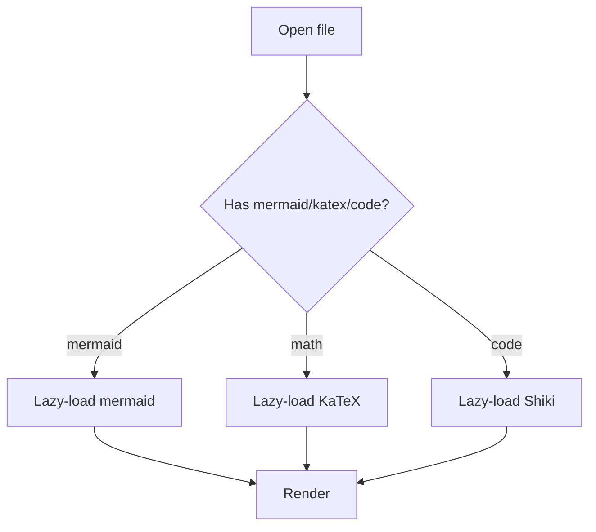

# LightMark Feature Showcase

This document exercises every renderer/engine feature implemented through M4. Open it with
**Open** or drag-and-drop it onto the viewer, then scroll to check TOC/breadcrumb tracking, and
try a narrow window to check breadcrumb collapsing.

## Table of Contents Check

This section and its children exist just to give the TOC/breadcrumb something deep to track.

### A Nested Subsection

Scroll slowly past this heading and confirm it becomes active exactly when its line reaches the
top of the viewer, not before and not after.

### A Nested Subsection

Same heading text as the previous one on purpose — this checks `core/slug.ts`'s duplicate-id
handling (`a-nested-subsection`, `a-nested-subsection-1`).

#### A Deeply Nested Heading With A Fairly Long Title To Exercise Breadcrumb Collapsing

At a narrow viewer width, the breadcrumb should collapse to `First > ... > Last` and then
ellipsize further if it still doesn't fit.

## GFM Basics

### Emphasis and Strikethrough

Plain, **bold**, *italic*, ***bold italic***, and ~~strikethrough~~ text. An autolink via
linkify: https://example.com should become clickable without `<a>` markup in the source.

### Task List

- [x] Render CommonMark + GFM
- [x] Build the TOC engine
- [ ] Wire up Zoom UI (deferred to M5)
- [ ] Ship Tauri packaging

### Table

| Feature | Milestone | Lazy Loaded |
| --- | --- | --- |
| Markdown renderer | M2 | No |
| Theme engine | M3 | No |
| Mermaid | M4 | Yes |
| KaTeX | M4 | Yes |
| Shiki | M4 | Yes |

### Blockquote

> Viewer only. No editing, no auto-save, no split editor.
>
> — `CLAUDE.md`

### Raw HTML Is Not Rendered

`html: false` means this line: <b>bold via raw HTML</b> should show up as literal escaped text,
not actual bold — that's the intended XSS-safety behavior, not a bug.

## Math (KaTeX)

Inline math: the quadratic formula is $x = \frac{-b \pm \sqrt{b^2 - 4ac}}{2a}$ right in the
middle of a sentence.

Block math:

$$
\sum_{i=1}^{n} i = \frac{n(n+1)}{2}
$$

An intentionally invalid inline expression (should show a ⚠️ warning, not silently fail):
$\notarealcommand{x}$

An intentionally invalid block expression (same warning, block form):

$$
\notarealcommand{x}
$$

## Code Blocks (Shiki)

TypeScript:

```ts
interface Heading {
  id: string;
  level: number;
  text: string;
}

function slugify(text: string): string {
  return text.toLowerCase().replace(/\s+/g, '-');
}
```

Rust:

```rust
fn read_file(path: &str) -> std::io::Result<String> {
    std::fs::read_to_string(path)
}
```

Python:

```python
def build_toc(headings):
    return [h for h in headings if h["level"] == 1]
```

A fenced block with no language (should stay plain, unhighlighted):

```
plain text in a code fence, no language tag
```

An unrecognized/typo'd language name (should fail gracefully and stay plain):

```not-a-real-language
this should not crash the renderer
```

## Diagram (Mermaid)



An intentionally broken diagram (should fail gracefully and leave the code block in place):

```mermaid
this is not valid mermaid syntax !!!
```

## Links and Images

[Internal link to the Table of Contents Check](#table-of-contents-check)


A broken image (should show a ⚠️ warning in place of the browser's default broken-image icon):


## Long-Scroll Padding

The sections below exist purely to make the document long enough to actually scroll through, so
active-heading tracking (IntersectionObserver + `scrollend` reconciliation) has real distance to
cover — including a fast scroll from here back up to the very top of the document.

### Padding Section One

Lorem ipsum dolor sit amet, consectetur adipiscing elit. Sed do eiusmod tempor incididunt ut
labore et dolore magna aliqua. Ut enim ad minim veniam, quis nostrud exercitation ullamco laboris
nisi ut aliquip ex ea commodo consequat.

Duis aute irure dolor in reprehenderit in voluptate velit esse cillum dolore eu fugiat nulla
pariatur. Excepteur sint occaecat cupidatat non proident, sunt in culpa qui officia deserunt
mollit anim id est laborum.

### Padding Section Two

Sed ut perspiciatis unde omnis iste natus error sit voluptatem accusantium doloremque laudantium,
totam rem aperiam, eaque ipsa quae ab illo inventore veritatis et quasi architecto beatae vitae
dicta sunt explicabo.

Nemo enim ipsam voluptatem quia voluptas sit aspernatur aut odit aut fugit, sed quia consequuntur
magni dolores eos qui ratione voluptatem sequi nesciunt.

#### Padding Section Two, Detail A

Neque porro quisquam est, qui dolorem ipsum quia dolor sit amet, consectetur, adipisci velit, sed
quia non numquam eius modi tempora incidunt ut labore et dolore magnam aliquam quaerat voluptatem.

#### Padding Section Two, Detail B

Ut enim ad minima veniam, quis nostrum exercitationem ullam corporis suscipit laboriosam, nisi ut
aliquid ex ea commodi consequatur.

### Padding Section Three

Quis autem vel eum iure reprehenderit qui in ea voluptate velit esse quam nihil molestiae
consequatur, vel illum qui dolorem eum fugiat quo voluptas nulla pariatur.

At vero eos et accusamus et iusto odio dignissimos ducimus qui blanditiis praesentium voluptatum
deleniti atque corrupti quos dolores et quas molestias excepturi sint occaecati cupiditate non
provident.

## End of Document

If you scrolled here from the top, the breadcrumb should have kept up the whole way. If you fast
scroll back to the very top now, **LightMark Feature Showcase** should end up focused again.
